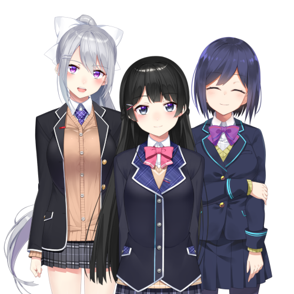

# Nijisanji Fansite

I decided learn some HTML and CSS and was inspired to create a Nijisanji fansite using what I learned.
The CSS (and probably HTML) is probably a mess so don't mind it - I'm just proud of the CSS animations I was able to implement into the site. Maybe I'll try to create a React version of this in the future.

Here's JK Gumi:
